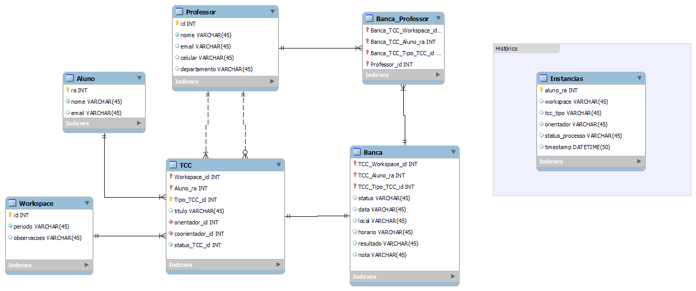

# Backend Sistema_TCC

Clique para voltar para as 
[Informações gerais](../README.md)

## Tecnologias:
O backend deste projeto foi desenvolvido com as seguintes tecnologias:

- [Node.Js](https://nodejs.org/en/about)
- [Prisma](https://www.prisma.io)
- [Neon](https://neon.tech)
- [Zod](https://zod.dev)
- [Fastify](https://fastify.dev)

## Instalação

Garanta que em seu sistema estejam instalados o Node e o npm.

Acesse a pasta Backend execute o seguinte comando para instalar:
```console
npm install
```

Caso for usar outro banco de dados que não o hospedado no servidor, execute o comando a seguir para incluir as migrations e assim criar as tabelas:

```console
npx prisma migrate dev
```

## Execução

Para executar o backend, acesse a pasta Backend e use o comando a seguir:
```console
npm run dev
```

O banco de dados está em um servidor neon, então não é necessário nenhuma criação de base de dados se quiser usar o sistema na forma original.

## Variáveis de ambiente

Em /Backend/.env existem variáveis usadas para o funcionamento do ambiente do servidor.

A primeira delas é a **DATABASE_URL**, a url da base de dados, se for utilizar outra base, é necessário alterar este link pelo da base que deseja utilizar.

Para o envio de email também é necessário trocar variáveis no .env o **USERMAIL** deve ser substituído pelo email que irá enviar emails no sistema. 

O **PASSMAIL** é uma senha gerada pelo provedor de email, no caso do Gmail siga estes [passos](https://support.google.com/accounts/answer/185833?hl=pt-BR) para saber como gerar uma.

Por fim, **EMAILPRATCC** é a variável que deve contér como valor o email do PRATCC, com essa informação ele poderá receber emails de quem está requisitando novos professores para o sistema.


## Banco de Dados
Abaixo um esquema do banco de dados que faz o sistema funcionar.



O principal desta base é a tabela TCC que se interage com aluno e workspace, ela representa o TCC do aluno dividido em etapas, uma instância para cada período em TCC, por exemplo: se o aluno Fez o TCC1 e o TCC2 e foi aprovado em âmbos, ele terá duas instâncias de TCC no banco de dados, esta tabela tem as mais importantes informações para o sistema, tem tudo necessário sobre o TCC do aluno ao está relacionadado a ele, dados como orientador, banca ou o próprio aluno estão em tabelas relacionadas.

A tabela de banca, contém as informações necessárias para a defesa de TCC do aluno, ela é relacionada com a tabela de professores, esta relação cria uma instância na tabela Banca_Professor, o que representa quais professores estão fazendo parte da banca desta defesa.

Os workpaces representam os períodos letivos, cada workspace representa um deles, onde é registrado na tabela TCC qual workspace atual, a partir desta informação é feita adivisão entre diferentes workspaces nas telas do sistema, o que possibilita ver em que etapa cada aluno estava no período passado.

Uma tabela a parte que é muito importante é a de instâncias, ela é necessária para o histórico de aluno nos dashboards, essa tabela é atualizada dentro do sistema sempre que um aluno troca de status, sempre que isso acontece, uma nova instância é criada, com o status atual do aluno e o dia e horário em que esta mudança aconteceu.

## Rotas

No backend são feitas as requisições ao banco de dados ou outras funções chamadas pelo frontend através de rotas, estas rotas existem para diversos propósitos, mas em geral para ler, criar, editar e deletar instâncias (CRUD).
As rotas existentes são:

- Alunos
- TCCs
- Professores
- Bancas
- União Banca/Professor
- Histórico
- Autenticação de Admin
- Autenticação de Aluno
- Envio de email
- Textos
- Workspace

Algumas destas rotas fazem além dos CRUDs e precisam de mais atenção

### Alunos

As rotas de alunos além de criar e editar, elas são essenciais para a exibição das instâncias durante o uso do sistema, todas as informações de alunos que aparecem nas telas são obtidos destas rotas.

### Autenticação de Admin

Estas rotas são as necessárias para fazer o login de admin, os dados são guardados com criptografia, o valor digitado na tela de login é recebido por essa rota, comparado com os dados criptografados e retornando um valor verdadeiro caso esteja correto.

### Autenticação de Aluno

Para acessar uma página de aluno, é necessário ter um link autenticado, ao gerar um link este link é associado ao ra do aluno, assim a partir do token é possível obter os dados do aluno, só após ser feita a verificação de token o usuário pode ter acessp á pagina.

### Envio de email

Estas rotas não cadastram coisas no banco de dados, e sim usam a função transport para enviar emails, existem duas rotas neste arquivo, uma delas é usada para traduzir as variáveis que o professor envia para o aluno para gerar o link autenticado para o aluno e enviar a mensagem por completo por email. A outra rota é usada quando o aluno quer fazer uma requisição de professor para o sistema, enviando todos os dados passados pelo aluno para o professor.

### Workspace

As rotas de workspace além de gerenciar todos os workspaces, também controla qual é o workspace ativo e qual deles é para ser mostrado na tela. 
São nestas rotas que estes valores podem ser alterados.
