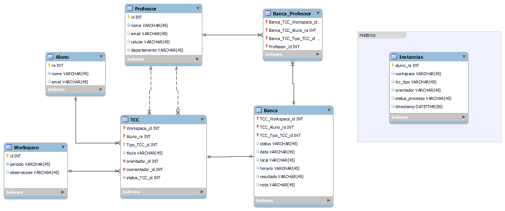

<h1 align="center" style="margin: 30px 0;">
     
    Sistema Gerenciador de TCC
</h1>

    Trabalho de Conclusão do Curso de Bacharelado em Ciência da Computação. 
    Caio José de Paula Cintra 
    Orientador: Prof. Rafael Liberto 
    <i>Dezembro de 2023</i> 

 

Este sistema foi desenvolvido para auxiliar O Professor Responsável pelas Atividades do TCC (PRATCC) no acompanhamento dos Trabalhos de Conclusão de Curso (TCC) no Bacharelado em Ciência da Computação da Universidade Tecnológica Federal do Paraná (UTFPR).

<b>
<h1>Sumário</h1>
    
<ul>
<li><a href="#instalação">Instalação</a>  </li>
<li><a href="#introdução">Introdução</a>  </li>
<li><a href="#processo">Processo</a>  </li>
<li><a href="#arquitetura">Arquitetura</a>  </li>
<li><a href="#tecnologias">Tecnologias</a>  </li>
<li><a href="#Variaveisdeambiente">Variáveis de ambiente</a>  </li>
<li><a href="#banco de dados">Banco de dados</a>  </li>
<li><a href="#rotas">Rotas</a>  </li>
<li><a href="#telas">Telas</a>  </li>
</ul>
</b>

# Instalação

Clique no link abaixo para acessar o passo a passo da instalação do sistema

[Instalação](Backend/README.md)

# Introdução

O curso de Bacharelado em Ciência da Computação (BCC) da Universidade Tecnológica Federal do Paraná (UTFPR) inclui a conclusão do curso com um trabalho final. O trabalho de conclusão de curso (TCC) é previsto no Projeto Pedagógico do Curso (PPC) e segue o regulamento de TCC da UTFPR. O processo de TCC é dividido em duas disciplinas.

No TCC1 o aluno submete sua proposta para avaliação e, uma vez aprovada, no TCC2 seu projeto é avaliado. Em ambas disciplinas, o aluno passa por etapas similares, tais como matrícula, definição do orientador, agendamento e composição da banca avaliadora e defesa do projeto. Durante toda a jornada percorrida pelo aluno nas disciplinas de TCC1 e TCC2, o Professor Responsável pelas Atividades do Trabalho de Conclusão de Curso (PRATCC) deve acompanhar e monitorar a evolução do aluno no processo.

O PRATCC também realiza intervenções pontuais juntamente aos alunos e seus orientadores para garantir o bom andamento do processo e para que os alunos não sejam penalizados pelo não cumprimento de uma atividade ou prazo. Por exemplo: O PRATCC irá entrar em contato com o aluno caso ele esteja próximo da data limite estipulada para informar um orientador sem ter um.

A ideia deste projeto surgiu com as dificuldades que o PRATCC tem em gerenciar e acompanhar todos os alunos no processo. Além de identificar em qual etapa cada aluno se encontra, em algumas situações, se faz necessário entrar em contato com o aluno para tentar evitar que algum prazo seja descumprido e gere uma reprovação ou desistência. O PRATCC também é responsável por toda a burocracia envolvida no processo como, por exemplo, a produção das atas das bancas, as declarações de participação para a banca examinadora, declaração de orientação, entre outros.

Tendo em vista o contexto apresentado, o objetivo deste trabalho é desenvolver um sistema que auxilie o PRATCC no gerenciamento dos trabalhos de conclusão de curso ao decorrer das disciplinas de TCC1 e TCC2.

# Processo

As Figuras a seguir ilustram as atividades que deverão ser percorridas pelo aluno durante o TCC 1 e TCC 2.

Com o intuito de auxiliar o gerenciamento dos alunos dentro do processo, definimos estados de dados que são produzidos quando cada tarefa do processo é concluída. Os estados de dados produzidos pelas instâncias são armazenados em uma tabela com os seguintes atributos:

- RA do aluno
- Semestre da matrícula
- Tipo do TCC (TCC 1 ou TCC 2)
- Status da instância
- Timestamp em que o estado foi gerado

Conforme o aluno avança no processo, novos estados de dados são produzidos indicando seu progresso. O atributo responsável por indicar o progresso do aluno dentro do processo é o _Status da Instância_. O atributo pode assumir os seguintes valores:

- Matriculado
- Orientador definido
- Banca agendada
- Banca confirmada
- Aprovado ou Reprovado

Por meio desses status, conseguimos identificar em qual etapa do processo cada aluno se encontra, bem como reproduzir toda a sua trajetória cronológica dentro do processo.

# Arquitetura

O sistema está estruturado com uma arquitetura de back-end e front-end. A Figura a seguir ilustra a arquitetura e as tecnologias utilizadas em cada parte.

    

# Tecnologias:

O backend deste projeto foi desenvolvido com as seguintes tecnologias:

- [Node.Js](https://nodejs.org/en/about)
- [Prisma](https://www.prisma.io/)
- [Neon](https://neon.tech/)
- [Zod](https://zod.dev/)
- [Fastify](https://fastify.dev/)

O frontend foi desenvolvido com as seguintes tecnologias:

- [Next.js](https://nextjs.org)
- [ReactJS](https://reactjs.org/)
- [Axios](https://github.com/axios/axios)
- [Tailwind CSS](https://tailwindcss.com)
- [Material UI](https://mui.com)
- [ESLint](https://eslint.org)

# Variáveis de ambiente

Em /Backend/.env existem variáveis usadas para o funcionamento do ambiente do servidor.

A primeira delas é a **DATABASE_URL**, a url da base de dados, se for utilizar outra base, é necessário alterar este link pelo da base que deseja utilizar.

Para o envio de email também é necessário trocar variáveis no .env o **USERMAIL** deve ser substituído pelo email que irá enviar emails no sistema.

O **PASSMAIL** é uma senha gerada pelo provedor de email, no caso do Gmail siga estes [passos](https://support.google.com/accounts/answer/185833?hl=pt-BR) para saber como gerar uma.

Por fim, **EMAILPRATCC** é a variável que deve contér como valor o email do PRATCC, com essa informação ele poderá receber emails de quem está requisitando novos professores para o sistema.

# Banco de Dados

Abaixo um esquema do banco de dados que faz o sistema funcionar.

O principal desta base é a tabela TCC que se interage com aluno e workspace, ela representa o TCC do aluno dividido em etapas, uma instância para cada período em TCC, por exemplo: se o aluno Fez o TCC1 e o TCC2 e foi aprovado em âmbos, ele terá duas instâncias de TCC no banco de dados, esta tabela tem as mais importantes informações para o sistema, tem tudo necessário sobre o TCC do aluno ao está relacionadado a ele, dados como orientador, banca ou o próprio aluno estão em tabelas relacionadas.

A tabela de banca, contém as informações necessárias para a defesa de TCC do aluno, ela é relacionada com a tabela de professores, esta relação cria uma instância na tabela Banca_Professor, o que representa quais professores estão fazendo parte da banca desta defesa.

Os workpaces representam os períodos letivos, cada workspace representa um deles, onde é registrado na tabela TCC qual workspace atual, a partir desta informação é feita adivisão entre diferentes workspaces nas telas do sistema, o que possibilita ver em que etapa cada aluno estava no período passado.

Uma tabela a parte que é muito importante é a de instâncias, ela é necessária para o histórico de aluno nos dashboards, essa tabela é atualizada dentro do sistema sempre que um aluno troca de status, sempre que isso acontece, uma nova instância é criada, com o status atual do aluno e o dia e horário em que esta mudança aconteceu.

# Rotas

No backend são feitas as requisições ao banco de dados ou outras funções chamadas pelo frontend através de rotas, estas rotas existem para diversos propósitos, mas em geral para ler, criar, editar e deletar instâncias (CRUD).
As rotas existentes são:

- Alunos
- TCCs
- Professores
- Bancas
- União Banca/Professor
- Histórico
- Autenticação de Admin
- Autenticação de Aluno
- Envio de email
- Textos
- Workspace

Algumas destas rotas fazem além dos CRUDs e precisam de mais atenção

### Alunos

As rotas de alunos além de criar e editar, elas são essenciais para a exibição das instâncias durante o uso do sistema, todas as informações de alunos que aparecem nas telas são obtidos destas rotas.

### Autenticação de Admin

Estas rotas são as necessárias para fazer o login de admin, os dados são guardados com criptografia, o valor digitado na tela de login é recebido por essa rota, comparado com os dados criptografados e retornando um valor verdadeiro caso esteja correto.

### Autenticação de Aluno

Para acessar uma página de aluno, é necessário ter um link autenticado, ao gerar um link este link é associado ao ra do aluno, assim a partir do token é possível obter os dados do aluno, só após ser feita a verificação de token o usuário pode ter acessp á pagina.

### Envio de email

Estas rotas não cadastram coisas no banco de dados, e sim usam a função transport para enviar emails, existem duas rotas neste arquivo, uma delas é usada para traduzir as variáveis que o professor envia para o aluno para gerar o link autenticado para o aluno e enviar a mensagem por completo por email. A outra rota é usada quando o aluno quer fazer uma requisição de professor para o sistema, enviando todos os dados passados pelo aluno para o professor.

### Workspace

As rotas de workspace além de gerenciar todos os workspaces, também controla qual é o workspace ativo e qual deles é para ser mostrado na tela.
São nestas rotas que estes valores podem ser alterados.

# Telas

O sistema contém as telas Matrícula, Orientador, Banca e Defesa nas partes de TCC1 e TCC2, além delas existem as páginas de Admin e de Dashboard.

### Matrícula

A tela de matrícula mostra todos os alunos recém-matriculados em TCC, ou seja, que ainda não foram atribuídos a um orientador. Existem botões para cadastrar novos alunos. Cada botão deste cadastra de maneira diferente; um deles é individual, ao clicar, abre um modal onde basta preencher um formulário sobre o aluno e confirmar os dados. O outro botão faz isso de uma forma mais eficiente caso seja necessário cadastrar mais de um aluno. Ele recebe um arquivo equivalente a um .csv que contenha as informações necessárias, dividindo os campos por vírgula e as instâncias por quebra de linha. Após isso, basta confirmar. Cada instância de aluno também contém um botão para editar e outro para remover o cadastro do sistema.

### Orientador

Na aba "Orientador", aparecem alunos com *status* de matriculado e alunos com Orientador Definido. Esta é a tela onde ele pode ser atribuído. Cada aluno contém um botão onde o próprio administrador do sistema pode atribuir um aluno a seu orientador e coorientador, se houver. Além disso, existe um botão de envio de e-mail para se comunicar de qualquer forma com o aluno. O e-mail também pode gerar um link para que o aluno acesse um formulário e preencha suas informações. Este link é autenticado com as informações do aluno, onde ele só pode acessar esta tela com o link, já que ele possui um token que irá identificar o RA do aluno para fazer as consultas e cadastros. Além deste botão de envio de e-mail, existe um em lote que enviará o e-mail para todos os alunos que estão sem orientador.

### Banca

Esta tela é dividida em duas partes. Ficarão todas as instâncias de alunos que possuem um orientador, mas ainda não agendaram a sua banca na parte superior. Nestes, pode ser feito o agendamento das bancas pelo professor administrador, abrindo o modal pelo botão e preenchendo o formulário. Mas também existe a opção de mandar o e-mail com o link autenticado, assim como na tela de orientador. Na parte inferior da tela ficarão os alunos que já agendaram a banca e estão esperando a confirmação e os que têm a banca já confirmada também. Aqui podem ser editadas as bancas. Caso já esteja tudo resolvido e seja possível confirmá-la para atualizar o *status* do aluno, já que ele só pode defender seu TCC se sua banca for confirmada, a confirmação pode ser feita diretamente pelo sistema, ou também é possivel enviar um email para o orientador do aluno para ele mesmo fazer a confirmação.

### Defesa

A defesa é a etapa final dos TCCs após o aluno apresentar seu TCC e realizar sua defesa, e nesta tela que será registrado seus resultados. Na tela, aparecerão todos alunos com a banca confirmada com um botão que abre um modal para poder registrar sua nota e uma possível observação. Caso o aluno tenha a nota igual ou superior a 6, ele troca seu *status* para "Aprovado"; caso contrário, ele é considerado reprovado. Nesta tela, também é possível gerar todos os documentos de declaração de presença na banca e de orientação que serão atribuídos aos professores participantes.

### Admin

A tela de Admin é onde é feita a configuração geral de cadastros. Nela, o usuário tem acesso para ser redirecionado para a tela de cadastrar e editar professores, e uma para cadastrar e editar textos, tanto de padrões de e-mail quanto de documentos. No caso de professores cadastrados com o departamento diferente de DACOM, eles não podem ser usados para orientar um aluno, apenas participar de banca, considerando que este é um sistema desenvolvido pensando no curso de Bacharelado em Ciência da Computação.

### Dashboard

A tela de Dashboard é uma parte estatística. Nela existem dados que fazem contagens para acompanhar alunos, assim como a aba de histórico. Nela, aparecem todos alunos do período e ao clicar em um deles é possível ver todas as trocas de *status* que ele teve, assim como o dia que isso aconteceu.

# Workspaces

Os workspaces representam um período onde são realizados os TCCs, é cadastrado o ano e a etapa do ano (ex: 2023/2) e quando um novo é criado, o anterior fica indisponível para alteração, porém ainda pode ser visualizado. Ao alterar o período no canto superior esquerdo da tela.

O administrador pode alternar entre o período atual e os anteriores e fazer comparações entre os alunos de cada um. Ao lado da seleção de período é possível abrir um modal que possibilitará finalizar o período atual ou criar um novo, o que também irá finalizar o anterior e deixar o atual como ativo, assim ele é adicionado na caixa de seleção do componente, começando um novo período.
