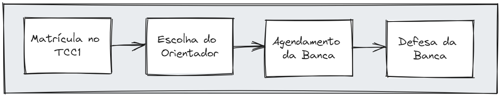
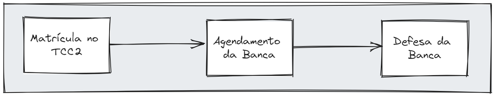
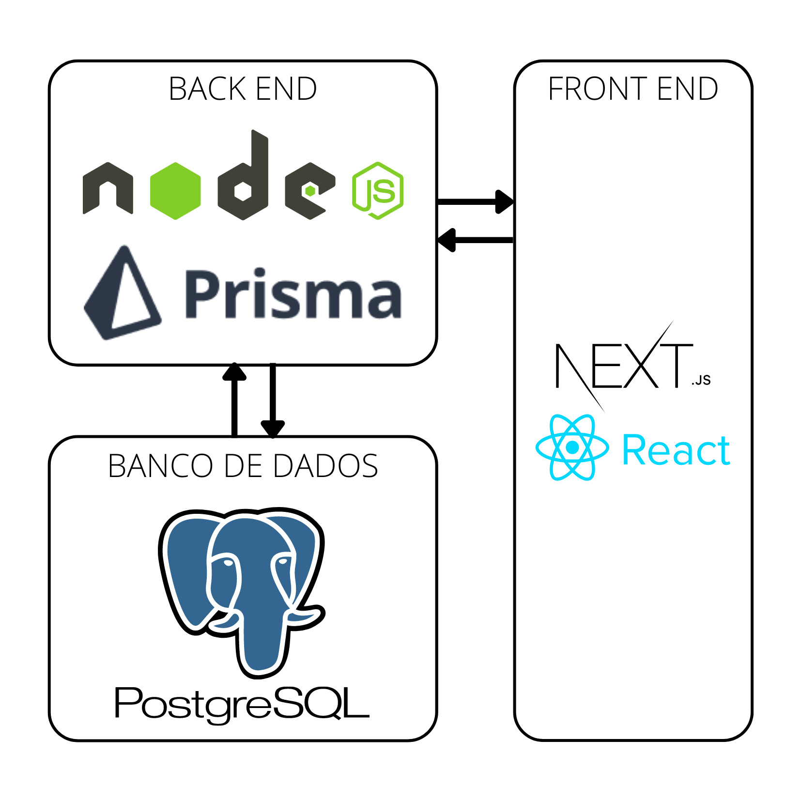

<h1 align="center" style="margin: 30px 0;">
     
    Sistema Gerenciador de TCC
</h1>

    Trabalho de Conclusão do Curso de Bacharelado em Ciência da Computação. 
    Caio José de Paula Cintra 
    Orientador: Prof. Rafael Liberto 
    <i>Dezembro de 2023</i> 

 

  <a href="#introdução">Introdução</a>&nbsp;&nbsp;&nbsp;|&nbsp;&nbsp;&nbsp;
  <a href="#processo">Processo</a>&nbsp;&nbsp;&nbsp;|&nbsp;&nbsp;&nbsp;
  <a href="#arquitetura">Arquitetura</a>&nbsp;&nbsp;&nbsp;|&nbsp;&nbsp;&nbsp;
  <a href="#instalação">Instalação</a>

Este sistema foi desenvolvido para auxiliar O Professor Responsável pelas Atividades do TCC (PRATCC) no acompanhamento dos Trabalhos de Conclusão de Curso (TCC) no Bacharelado em Ciência da Computação da Universidade Tecnológica Federal do Paraná (UTFPR).

# Introdução

O curso de Bacharelado em Ciência da Computação (BCC) da Universidade Tecnológica Federal do Paraná (UTFPR) inclui a conclusão do curso com um trabalho final. O trabalho de conclusão de curso (TCC) é previsto no Projeto Pedagógico do Curso (PPC) e segue o regulamento de TCC da UTFPR. O processo de TCC é dividido em duas disciplinas.

No TCC1 o aluno submete sua proposta para avaliação e, uma vez aprovada, no TCC2 seu projeto é avaliado. Em ambas disciplinas, o aluno passa por etapas similares, tais como matrícula, definição do orientador, agendamento e composição da banca avaliadora e defesa do projeto. Durante toda a jornada percorrida pelo aluno nas disciplinas de TCC1 e TCC2, o Professor Responsável pelas Atividades do Trabalho de Conclusão de Curso (PRATCC) deve acompanhar e monitorar a evolução do aluno no processo.

O PRATCC também realiza intervenções pontuais juntamente aos alunos e seus orientadores para garantir o bom andamento do processo e para que os alunos não sejam penalizados pelo não cumprimento de uma atividade ou prazo. Por exemplo: O PRATCC irá entrar em contato com o aluno caso ele esteja próximo da data limite estipulada para informar um orientador sem ter um.

A ideia deste projeto surgiu com as dificuldades que o PRATCC tem em gerenciar e acompanhar todos os alunos no processo. Além de identificar em qual etapa cada aluno se encontra, em algumas situações, se faz necessário entrar em contato com o aluno para tentar evitar que algum prazo seja descumprido e gere uma reprovação ou desistência. O PRATCC também é responsável por toda a burocracia envolvida no processo como, por exemplo, a produção das atas das bancas, as declarações de participação para a banca examinadora, declaração de orientação, entre outros.

Tendo em vista o contexto apresentado, o objetivo deste trabalho é desenvolver um sistema que auxilie o PRATCC no gerenciamento dos trabalhos de conclusão de curso ao decorrer das disciplinas de TCC1 e TCC2.

# Processo

As Figuras a seguir ilustram as atividades que deverão ser percorridas pelo aluno durante o TCC 1 e TCC 2.

Com o intuito de auxiliar o gerenciamento dos alunos dentro do processo, definimos estados de dados que são produzidos quando cada tarefa do processo é concluída. Os estados de dados produzidos pelas instâncias são armazenados em uma tabela com os seguintes atributos:

- RA do aluno
- Semestre da matrícula
- Tipo do TCC (TCC 1 ou TCC 2)
- Status da instância
- Timestamp em que o estado foi gerado

Conforme o aluno avança no processo, novos estados de dados são produzidos indicando seu progresso. O atributo responsável por indicar o progresso do aluno dentro do processo é o _Status da Instância_. O atributo pode assumir os seguintes valores:

- Matriculado
- Orientador definido
- Banca agendada
- Banca confirmada
- Aprovado ou Reprovado

Por meio desses status, conseguimos identificar em qual etapa do processo cada aluno se encontra, bem como reproduzir toda a sua trajetória cronológica dentro do processo.

# Arquitetura

O sistema está estruturado com uma arquitetura de back-end e front-end. A Figura a seguir ilustra a arquitetura e as tecnologias utilizadas em cada parte.

    

# Instalação

O manual de instalação se encontra dentro de cada repositório

[Backend](Backend/README.md)

[Frontend](frontend/README.md)
