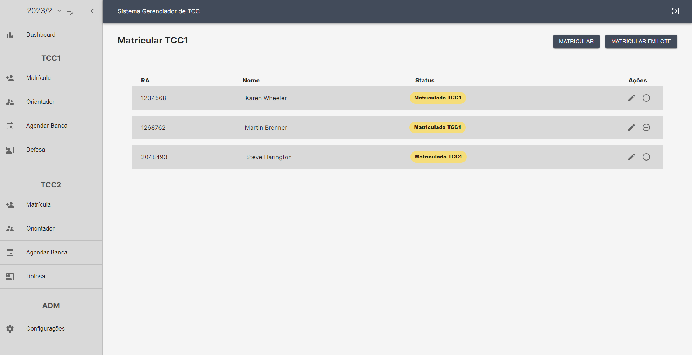
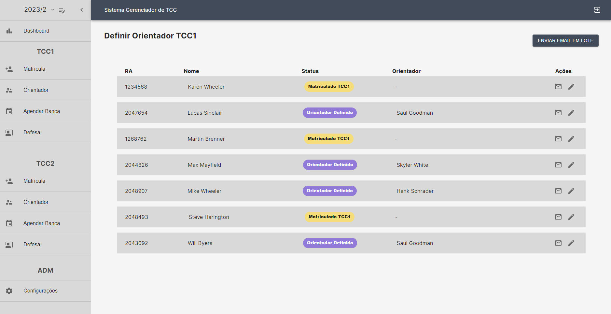
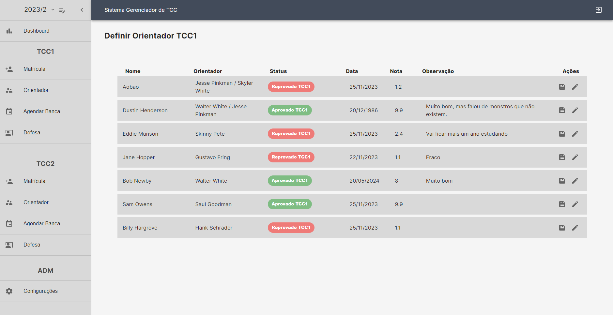
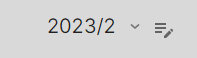

# Frontend Sistema_TCC

Clique para voltar para as 
[Informações gerais](../README.md)

## Tecnologias:
O frontend deste projeto foi desenvolvido com as seguintes tecnologias:

- [Next.js](https://nextjs.org)
- [ReactJS](https://reactjs.org/)
- [Axios](https://github.com/axios/axios)
- [Tailwind CSS](https://tailwindcss.com)
- [Material UI](https://mui.com)
- [ESLint](https://eslint.org)

## Instalação

Garanta que em seu sistema esteja instalado o npm.

Acesse a pasta frontend execute o seguinte comando para instalar:
```console
npm install
```

## Execução

Para executar o frontend, acesse a pasta frontend e use o comando a seguir:
```console
npm run dev
```

## Acessar
Quando o sistema estiver executando acesse em seu navegador o endereço para acessar o sistema, o padrão é http://localhost:3000

**Certifique-se de que o backend está em execução também, caso contrário o sistema não irá funcionar corretamente**

# Telas

O sistema contém as telas Matrícula, Orientador, Banca e Defesa nas partes de TCC1 e TCC2, além delas existem as páginas de Admin e de Dashboard.

### Matrícula

A tela de matrícula mostra todos os alunos recém-matriculados em TCC, ou seja, que ainda não foram atribuídos a um orientador. Existem botões para cadastrar novos alunos. Cada botão deste cadastra de maneira diferente; um deles é individual, ao clicar, abre um modal onde basta preencher um formulário sobre o aluno e confirmar os dados. O outro botão faz isso de uma forma mais eficiente caso seja necessário cadastrar mais de um aluno. Ele recebe um arquivo equivalente a um .csv que contenha as informações necessárias, dividindo os campos por vírgula e as instâncias por quebra de linha. Após isso, basta confirmar. Cada instância de aluno também contém um botão para editar e outro para remover o cadastro do sistema.



### Orientador

Na aba "Orientador", aparecem alunos com *status* de matriculado e alunos com Orientador Definido. Esta é a tela onde ele pode ser atribuído. Cada aluno contém um botão onde o próprio administrador do sistema pode atribuir um aluno a seu orientador e coorientador, se houver. Além disso, existe um botão de envio de e-mail para se comunicar de qualquer forma com o aluno. O e-mail também pode gerar um link para que o aluno acesse um formulário e preencha suas informações. Este link é autenticado com as informações do aluno, onde ele só pode acessar esta tela com o link, já que ele possui um token que irá identificar o RA do aluno para fazer as consultas e cadastros. Além deste botão de envio de e-mail, existe um em lote que enviará o e-mail para todos os alunos que estão sem orientador.



### Banca

Esta tela é dividida em duas partes. Ficarão todas as instâncias de alunos que possuem um orientador, mas ainda não agendaram a sua banca na parte superior. Nestes, pode ser feito o agendamento das bancas pelo professor administrador, abrindo o modal pelo botão e preenchendo o formulário. Mas também existe a opção de mandar o e-mail com o link autenticado, assim como na tela de orientador. Na parte inferior da tela ficarão os alunos que já agendaram a banca e estão esperando a confirmação e os que têm a banca já confirmada também. Aqui podem ser editadas as bancas. Caso já esteja tudo resolvido e seja possível confirmá-la para atualizar o *status* do aluno, já que ele só pode defender seu TCC se sua banca for confirmada.


### Defesa

A defesa é a etapa final dos TCCs após o aluno apresentar seu TCC e realizar sua defesa, e nesta tela que será registrado seus resultados. Na tela, aparecerão todos alunos com a banca confirmada com um botão que abre um modal para poder registrar sua nota e uma possível observação. Caso o aluno tenha a nota igual ou superior a 6, ele troca seu *status* para "Aprovado"; caso contrário, ele é considerado reprovado. Nesta tela, também é possível gerar todos os documentos de declaração de presença na banca e de orientação que serão atribuídos aos professores participantes.




### Admin

A tela de Admin é onde é feita a configuração geral de cadastros. Nela, o usuário tem acesso para ser redirecionado para a tela de cadastrar e editar professores, e uma para cadastrar e editar textos, tanto de padrões de e-mail quanto de documentos. No caso de professores cadastrados com o departamento diferente de DACOM, eles não podem ser usados para orientar um aluno, apenas participar de banca, considerando que este é um sistema desenvolvido pensando no curso de Bacharelado em Ciência da Computação.

### Dashboard

A tela de Dashboard é uma parte estatística. Nela existem dados que fazem contagens para acompanhar alunos, assim como a aba de histórico. Nela, aparecem todos alunos do período e ao clicar em um deles é possível ver todas as trocas de *status* que ele teve, assim como o dia que isso aconteceu.


# Workspaces

Os workspaces representam um período onde são realizados os TCCs, é cadastrado o ano e a etapa do ano (ex: 2023/2) e quando um novo é criado, o anterior fica indisponível para alteração, porém ainda pode ser visualizado. Ao alterar o período no canto superior esquerdo da tela.




O administrador pode alternar entre o período atual e os anteriores e fazer comparações entre os alunos de cada um. Ao lado da seleção de período é possível abrir um modal que possibilitará finalizar o período atual ou criar um novo, o que também irá finalizar o anterior e deixar o atual como ativo, assim ele é adicionado na caixa de seleção do componente, começando um novo período.
